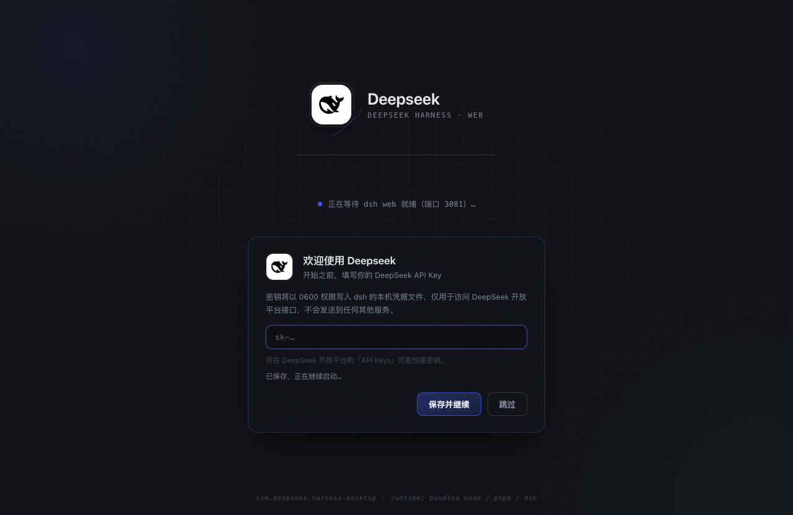

# Deepseek

<p align="center">
  
</p>

<p align="center">
  <strong>DeepSeek Harness 的桌面形态</strong> —— 官方运行时，桌面体验。
</p>

<p align="center">
  <a href="https://github.com/HongMing-Huang/deepseek-harness-desktop/releases/latest"></a>
  <a href="./LICENSE"></a>
  <a href="./actions/workflows/ci.yml"></a>
  <a href="./actions/workflows/release.yml"></a>
  <a href="https://hongming-huang.github.io/deepseek-harness-desktop/"></a>
  
</p>

Deepseek（仓库 `deepseek-harness-desktop`）把官方 DeepSeek Harness 的本地 Web UI 打包为开箱即用的桌面应用：内嵌 Node / pnpm / dsh 运行时，零环境依赖；官方 dsh web **一律不改动、不注入**，桌面壳只做体验层——会话中心、插件市场、托盘通知，全部外挂实现。

## 界面预览

| 启动引导 | 官方 Web 界面 | 会话中心 |
| --- | --- | --- |
|  |  |  |

## 特性

- **零依赖内嵌运行时**：Node、pnpm、dsh 随包分发，不碰系统环境，删掉 App 即彻底卸载；
- **贴合官方**：运行时来自 npm 官方分发并做来源校验；每 6 小时自动检查新版本、人工验证后合并，不做静默升级；
- **会话管理中心**：项目卡片首页（Trae 风格）+ 跨工作区浏览 / 搜索 / 恢复 / 导出（官方 zip / Markdown / JSONL），对官方数据全程只读；
- **插件市场 2.0**：精选目录 + dshfind 在线市场（1200+ 条目搜索即装）、兼容徽章、健康检查、一键全量更新、GitHub 源码直装；
- **托盘常驻 + 原生通知**：关窗驻留，出错 / 更新 / 插件操作以系统通知送达；
- **一键诊断与修复**：启动失败分类、端口占用清理、双轨更新失败自动回退。

## 安装

- **直接下载**：[Latest Release](https://github.com/HongMing-Huang/deepseek-harness-desktop/releases/latest)（macOS dmg / zip，Linux deb / AppImage，均附 SHA256 清单）
- **官网**：[hongming-huang.github.io/deepseek-harness-desktop](https://hongming-huang.github.io/deepseek-harness-desktop/)（平台推荐 + 安装引导 + FAQ）
- 当前产物**未签名**：macOS 首次打开请「右键 → 打开」放行（官网 FAQ 有步骤）。

### 从源码构建

前置：Node >= 22.19.0、npm。

```bash
git clone https://github.com/HongMing-Huang/deepseek-harness-desktop.git
cd deepseek-harness-desktop
npm install                # 安装开发依赖
npm run prepare:runtime    # 下载内嵌 node/pnpm 并安装官方 dsh（幂等，含来源校验）
npm run dev                # 本地开发运行
npm run typecheck && npm run test   # 类型检查 + 单测
npm run build              # 构建 out/（main/preload/renderer）

# 打包（按目标组合瘦身运行时，再 electron-builder）
npm run dist:mac-arm64     # 本机默认
npm run dist:linux-x64
```

产物输出至 `release/`；`resources/runtime/`、`out/`、`release/`、`node_modules/` 均不入版本库。

## 功能详解

**红线**：官方 dsh web 不修改、不注入（`dshWebView` 无 preload、强沙箱）；dsh 运行时始终来自官方 npm 分发。

- **会话中心**（菜单「工具 → 会话中心」`Cmd/Ctrl+Shift+S`，托盘同级入口）：列表数据来自官方 `workspace.list` / `session.list` RPC 与 `~/.dsh` 本地存储双源合并，web 未就绪自动回退本地直读；全文搜索走官方 `session.search`，部署关闭索引时回退标题/路径匹配；导出走官方 `/api/session.export`（zip 含子代理会话），Markdown / JSONL 由本地按官方 zstd 帧算法解码渲染（离线可用）；「恢复」打开官方 Web 界面并定位会话所在项目目录。**对 `~/.dsh` 全程只读。**
- **插件市场 2.0**：目录条目分 `npm`（registry 分发，pin 精确版本；含 scoped 包）与 `github`（仅源码分发，`git+https…@<提交>` 直装）两类来源，直装规格经主进程白名单校验；安装/全量更新时按官方指引自动把包名写入 profile `pnpm-workspace.yaml` 的 `allowBuilds`（pnpm 10 映射形态）放行构建脚本；健康检查四态徽章 + 一键全量更新（`dsh plugin update` 转发 pnpm update）。
- **dshfind 在线市场**：应用内「插件 → dshfind 市场」Tab，主进程拉取并解析 dshfind.com 列表页（1200+ 条目），userData 缓存 24h 本地搜索；安装复用其官方命令 `github:<author>/<name>`；网络/结构变化均明确降级，不产出垃圾条目。

## 更新边界

| 内容 | 更新方式 | 频率 |
| --- | --- | --- |
| dsh 运行时（`src/shared/versions.ts`） | `sync-upstream` 机器人检测 npm 新版本 → 开 PR → **人工验证合并** | 每 6 小时检查 |
| 应用壳版本（`package.json` version） | 「版本 PR」人工 bump，Release 认 `v*` tag | 按需 |
| 应用内 dsh 热更（侧载） | 应用内检查与安装，失败自动回退 | 24h 节流 / 手动 |
| 插件目录 pin（`plugin-catalog.json`） | 人工验证 npm/GitHub 后提交 | 按需 |
| dshfind 市场数据 | 应用内拉取缓存，TTL 24h | 每次搜索检查 |
| 官网 `site/` | 随 main 提交，`pages.yml` 自动部署 | 随提交 |
| 官方 dsh web | **永不修改、永不注入** | — |
| 用户数据 `~/.dsh` | **应用从不改写**（会话中心只读，插件操作走官方 `dsh plugin`） | — |

## 未来方向

| 方向 | 状态 | 说明 |
| --- | --- | --- |
| Windows 构建 | 未支持 | `prepare-runtime` 为 POSIX-only（darwin/linux）；需先完成运行时准备与路径/环境变量的跨平台移植 |
| 启动直达工作台首页 | 规划中 | 主窗口落地项目卡片页、点卡片进官方 web |
| macOS 签名/公证 | 暂缓 | 当前未签名构建，首启需放行 |
| 手机远程控制 / IM 通道 | 未规划 | 对端 App 与鉴权面大，属独立项目 |

## 架构与安全

标准 Electron 三层结构（main / preload / renderer），IPC 通道在 `src/shared/ipc.ts` → `src/main/ipc.ts` → `src/preload/index.ts` 三处集中登记。目录树、数据流与关键决策见 [ARCHITECTURE.md](ARCHITECTURE.md)；威胁模型、报告渠道与构建安全见 [SECURITY.md](SECURITY.md)；开发环境、代码规范与 PR 流程见 [CONTRIBUTING.md](CONTRIBUTING.md)。

```
src/
├── main/                      # 主进程
│   ├── index.ts               # 应用生命周期、窗口管理、运行时引导
│   ├── ipc.ts                 # IPC 集中注册表
│   ├── windows.ts             # 主窗口 / dsh web 视图 / 自有窗口与外链守卫
│   ├── tray.ts                # 托盘常驻 + 原生通知（notify-gate.ts 去重）
│   ├── sessions.ts            # 会话中心（官方 RPC 与 ~/.dsh 双源只读）
│   ├── config.ts / logger.ts  # 配置读写 / 文件日志
│   └── runtime/
│       ├── paths.ts           # 内嵌运行时路径解析与子进程环境
│       ├── process-supervisor.ts  # dsh web 子进程托管
│       ├── dsh-installer.ts   # dsh 侧载安装/校验/失败回退
│       ├── port-doctor.ts     # 端口占用诊断与清理
│       ├── plugins.ts         # 插件安装/卸载/健康/全量更新/直装
│       ├── plugin-progress.ts # pnpm 输出进度解析
│       ├── dshfind.ts         # dshfind 在线市场（拉取/解析/缓存/搜索）
│       ├── updater.ts         # 双轨更新（壳 Release + dsh 热切换）
│       └── error-classifier.ts # 启动失败分类与动作建议
├── preload/index.ts           # contextBridge 白名单（仅暴露 window.api）
├── renderer/                  # 渲染进程（纯原生 JS，无框架）
│   ├── splash / settings / plugins（含 dshfind 市场）/ sessions
└── shared/                    # IPC 通道与载荷定义、运行时版本清单

tests/                         # node:test 单测 + playwright-core CDP E2E（七场景）
```

## 官方生态链接

- 官方插件管理文档：[apps/cli/reference#plugin-management](https://github.com/deepseek-ai/deepseek-harness/blob/master/apps/cli/reference/README.md#plugin-management)
- 官方架构说明：[docs/architecture.md](https://github.com/deepseek-ai/deepseek-harness/blob/master/docs/architecture.md)
- Cordis 插件内核：[cordiverse/cordis](https://github.com/cordiverse/cordis)
- 社区插件市场：[dshfind.com/zh/plugins](https://dshfind.com/zh/plugins)（已接入应用内市场）
- 社区插件雷达：[awesome-dsh-plugins](https://github.com/AdamPlatin123/awesome-dsh-plugins)

## CI/CD 与发布

流水线位于 `.github/workflows/`：`ci.yml`（typecheck/test/build/隐私扫描门禁）、`sync-upstream.yml`（每 6h 检查官方 dsh 新版本开 PR）、`release.yml`（`v*` tag → 四平台矩阵构建 + 冒烟 + SHA256 清单 + 创建 Release）、`pages.yml`（官网自动部署）。

**发布步骤**：① main 上 CI 绿色 → ② 版本 PR bump `version` 并补 CHANGELOG → ③ `git tag vX.Y.Z && git push origin vX.Y.Z` → ④ Release 自动构建与发布。

## 隐私与注释约定

注释与文档只写开发内容，禁止个人信息（用户名、私有绝对路径、邮箱、主机名等）；`scripts/lint-privacy.mjs` 为 CI 门禁。应用与构建过程永不触碰 `~/.dsh`（凭据、配置、会话、插件均属 dsh 自身）。

## 卸载残留位置

| 位置 | 内容 | 说明 |
| --- | --- | --- |
| macOS `~/Library/Application Support/Deepseek/runtimes/`（Linux `~/.config/Deepseek/runtimes/`） | dsh 侧载更新目录 | 删除后下次启动自动回用内嵌版本 |
| `.../Deepseek/preferences.json` | 应用偏好 | 删除后恢复默认值 |
| `~/.dsh/` | dsh 自身配置（凭据/会话/插件） | 由 dsh 管理，卸载应用不涉及 |
| `.../Deepseek/logs/main.log` | 主进程日志 | 排障用，可安全删除 |

## License

[MIT](LICENSE) © 2026 Deepseek Harness Desktop Contributors

> 本项目是基于 DeepSeek Harness 构建的桌面社区版，并非 DeepSeek 官方产品；DeepSeek 及相关标识归其权利人所有。
